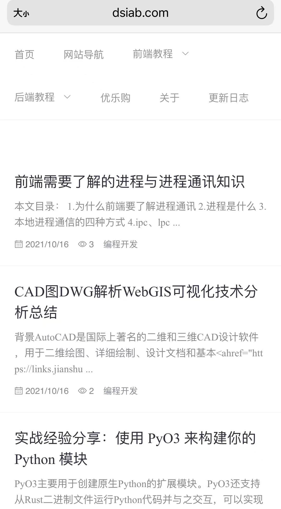

### nuxt-web


### 项目介绍：

主要技术: nuxtjs2.0 + element-ui2.0

使用到的插件： axios  + less


### 关联项目

同另外两个项目一起组成了一个博客系统：

springbootAdmin(https://gitee.com/wilkwo/springbootAdmin)

vueAdmin(https://gitee.com/wilkwo/vueAdmin) 


### 演示地址

官网：[www.dsiab.com](https://www.dsiab.com)

拉取代码后运行可看到效果，不用跑后端服务，直接调用官网接口。

欢迎fork，欢迎提问题。


### 后台管理地址： 

http://admin.dsiab.com

测试账号：test

测试密码：test


### PC演示


### 移动端演示

<!--  -->




### 选择nuxt的原因：

1.nuxt开发的项目能被搜索引擎收录,能进行seo，需要将页面改为restful风格

2.相比其他语言，nuxt更简单，跟vue开发一样简单，会前端就可以开发，比vue更简单，只需要将文件按目录新建好，nuxt会自动生成对应路由。

3.能正常接入统计跟广告代码


### nuxt不足

1.由于Nuxt采用服务端渲染，所以影响页面打开速度很多，包括页面内容大小，服务器性能，网络带宽等。所以nuxt项目可以将页面的主要内容进行服务端渲染，其他内容还是可以在浏览器端进行ajax请求，这样可以大大减少服务器压力。

2.采用element-ui部分功能对搜索引擎及seo不够友好，因为element-ui组件需要跳转的链接都不是通过a链接，所以这些组件需要手写或者在element-ui的基础上做修改。比如 菜单部分、分页组件都需要进行修改。

3.性能上比起php要逊色一些。

### 提升加载性能

某些时候某些接口并不需要都在服务端渲染，可以在浏览器渲染。
比如目前首页列表是服务端调用渲染，右侧菜单的推荐跟分类是浏览器渲染，即跟正常的ajax调用一样

注意浏览器调接口需要配置nginx反向代理，具体可参考：https://www.dsiab.com/post/4421

- 这里是列表文本


### 如何启动应用

```bash

# 下载代码
git clone https://gitee.com/wilkwo/nuxt-web.git

# 安装依赖
$ npm install

# 本地启动在 localhost:3000
$ npm run dev

# 部署到服务器，先build，再执行start启动

$ npm run build

$ npm run start

# 生成静态项目

$ npm run generate
```


### 感谢赞赏

您的支持是持续更新的动力！


